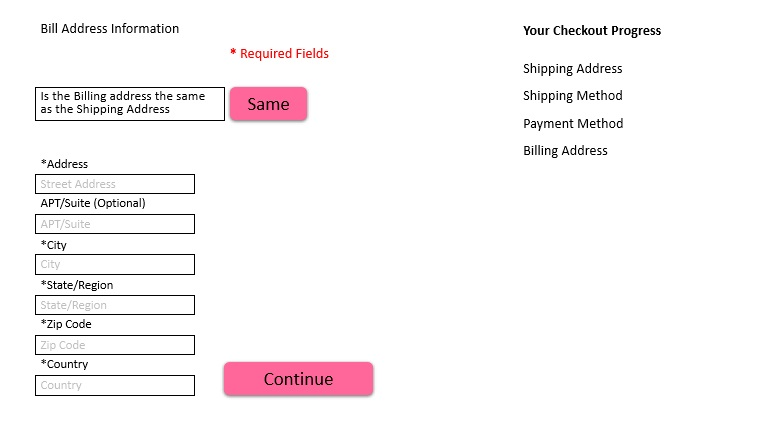

# Billing Address Page

Once the customer get to the billing address information if the billing address and the shipping address are the same then customer doesn't have to enter it again. if a customer is sending the products to somebody else or to a different location then the address that is associated to the billing address then it would need to added here.
