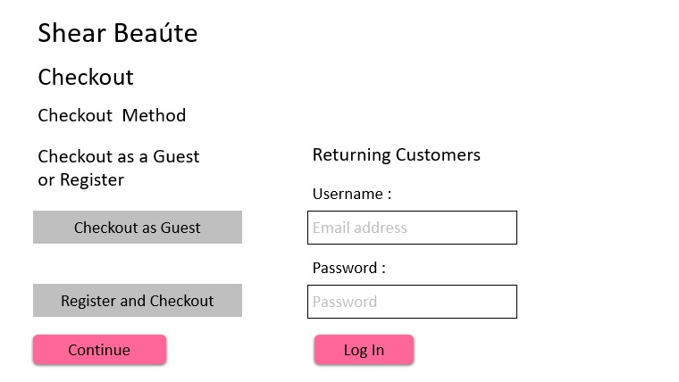

# Initial Checkout Page

Once the customer has selected the products that they are going to purchase then the checkout process starts here. The customer would be asked if they wish to checkout as a guess or register with the website. If they are a returning customer then they can login here before the check out to pull up their information from the servers.
