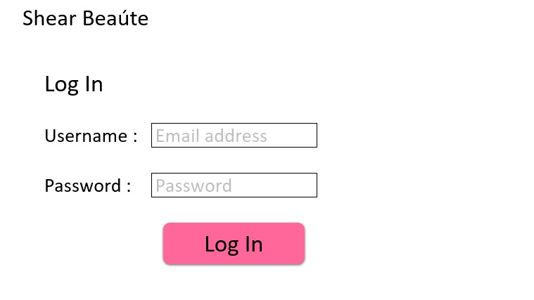

# Log In Page

If a customer is registered with the salons website once they select the login button on the main page it will bring them to this login page. The Username would be the customers email address so that the salon could validate the customer is real and able to send receipts and discounts to the customer. The password would look to be a strong password requirement so that in the future the website could store payment information with secure financial servers. Once a customer has logged in successfully then they would be sent back to the main page. 
