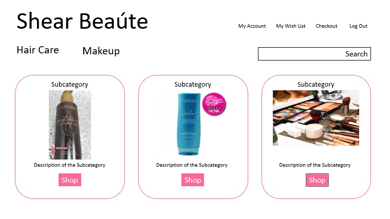

# Main Page after LogIn

If a customer is registered with the website and they have logged in the main page will change just a little. In the top right corner next to the Checkout button there would be a wishlist button and My Account button added and the login button would change to a logout button. 
