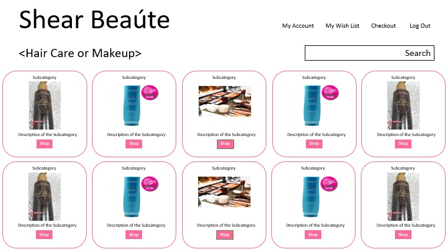

# Searching after Logged In

If a customer is loggedIn then in the top right corner the my account, wishlist and logout buttons would be there. When a customer selects a product to view it wouldn't matter if they are loggedin or not they would be taken to a product page.
