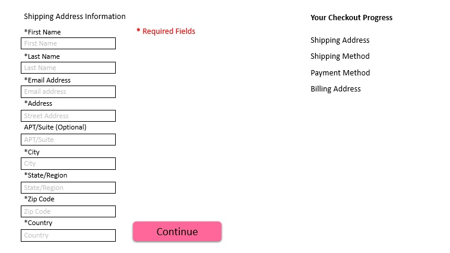

# Shipping Address Page

Once the customer has chose which way they are going to checkout then they would have to fill out shipping information. If the customer is registered with the website then their information could be stored in a database for the salon making it easier for customers to checkout.
